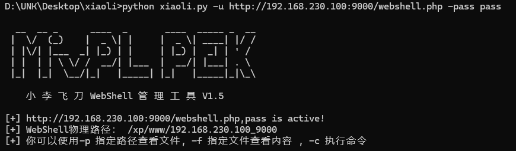

# 小李飞刀 WebShell 管理工具 V1.5

欢迎使用小李飞刀 WebShell 管理工具 V1.5，这是一个用python 开发用于 WebShell 的管理和操作的Python 脚本。

## 功能

- 检测 WebShell 是否活跃
- 执行系统命令
- 查看指定路径下的文件和目录
- 获取文件内容

## 安装

确保你的系统已经安装了 Python 和以下 Python 库：

- requests
- argparse
- random
- sys

你可以通过以下命令安装所需的库：

```bash
pip install requests
```

## 使用方法

运行脚本时，你可以使用以下参数：

- `-u` 或 `--url`: 指定 WebShell 的 URL
- `-pass` 或 `--password`: 指定 WebShell 的密码
- `-p` 或 `--path`: 指定要查看的路径
- `-f` 或 `--filename`: 指定要查看内容的文件名
- `-c` 或 `--command`: 指定要执行的命令

### 示例

检测 WebShell 是否活跃：

```bash
python xiaoli.py -u http://example.com/shell.php -pass yourpassword
```


执行系统命令：

```bash
python xiaoli.py -u http://example.com/shell.php -pass yourpassword -c "ls -la"
```


查看指定路径下的文件和目录：

```bash
python xiaoli.py -u http://example.com/shell.php -pass yourpassword -p "/var/www/"
```

获取文件内容：

```bash
python xiaoli.py -u http://example.com/shell.php -pass yourpassword -f "index.html"
```

## 注意事项

- 确保在使用本工具时遵守当地法律法规。
- 不要将本工具用于非法侵入或攻击他人网站。

## 贡献

如果你有任何建议或想要贡献代码，请提交 Pull Request 或创建 Issue。

## 许可

本项目采用 [MIT 许可证](LICENSE)。
